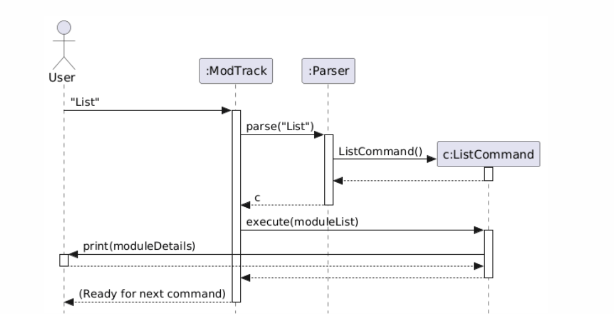
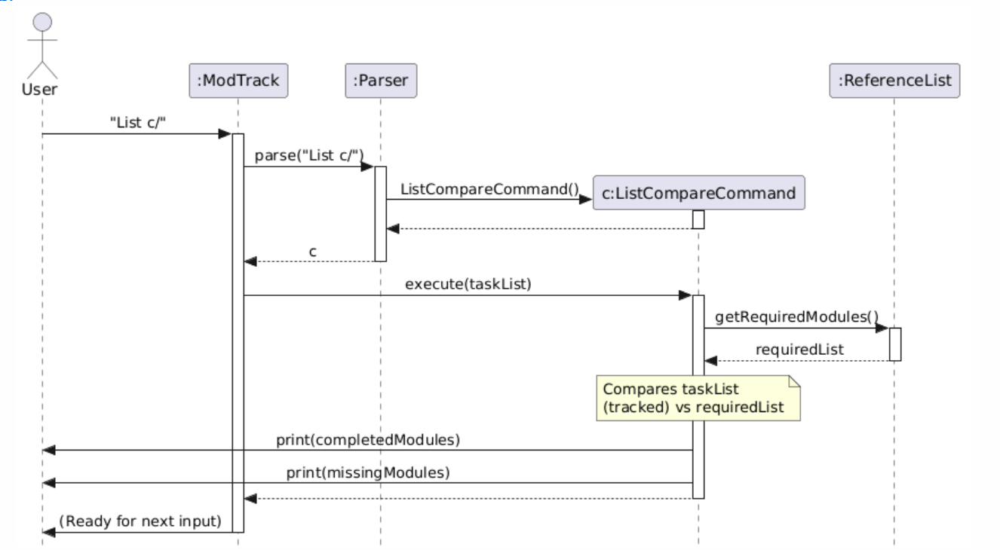

# CS2113 T09-1 tp Developer Guide

## Table of Contents
1. [Setup Guide](#setup-guide)

2. [Design](#design)
    - [UI component](#ui-component)
    - [Command component](#command-component)
    - [Storage component](#storage-component)
    - [Parser component](#parser-component)

3. [Implementation](#implementation)
    - [Haofu's enhancements](#haofus-enhancements)
        - [Add feature](#1-add-feature)
        - [Delete feature](#2-delete-feature)
    - [Yang Han's enchancements](#yang-hans-enchancement)
        - [List feature](#3-list-feature)
    - [Christina's enhancement](#christinas-enchancements)
        - [Mark feature](#4-mark-feature)
        - [Unmark feature](#5-unmark-feature)
    - [Ang Lee's enhancement](#ang-lees-enhancements)
        - [Exit feature](#6-exit-feature)
        - [Show Graduation Requirement feature](#7-show-graduation-requirement-feature)

4. [Product Scope](#product-scope)
    - [Target User Profile](#target-user-profile)
    - [Value Proposition](#value-proposition)

5. [User Stories](#user-stories)

6. [Non-Functional Requirements](#non-functional-requirements)

7. [Glossary](#glossary)

## Setup Guide

### Steps

1. Download the tp.jar file from release v1.0 into the folder where you plan to run the application

2. Go to project folder where the jar file is located

3. Run the application using java
```
java -jar tp.jar
```

{list here sources of all reused/adapted ideas, code, documentation, and third-party libraries -- include links to the original source as well}

## Design & implementation

{Describe the design and implementation of the product. Use UML diagrams and short code snippets where applicable.}
### Design 

** architecture diagram **

### Main components of the architecture 
`ModTrack` class is the main class 

The Program has 4 main components: 

`UI`: The user interface - reads raw user input and displays formatted output back to the command line terminal 

`Parser`: Interprets the commands - handles command extractions by breaking down user input based on the relevant flags 
eg.( n/, y/) to translate raw user input into executable command objects

`Command`: Executes the respective commands 

`Storage`: Manages file I/O operations to enable list storage. 

### Component interactions 

** Architecture sequence diagrams ** 

### UI Class

The UI class serves as the exclusive interface for human-computer interaction, 
responsible for capturing user input and displaying formatted output while keeping the program's core logic separate 
from the presentation.

It has the following key operations:
showOpeningText()
showClosingText()


### Parser Class 

### Command Class 

### Storage Clas


### Command Component
The Command mechanism is facilitated by the abstract `Command` class. It serves as the base for all executable actions within **ModTrack**, allowing the `Parser` to delegate logic to specific command objects.

The abstract `Command` class defines a core method: `execute(ArrayList<Mod> list)`. Concrete subclasses implement this method to perform specific operations on the module list.

While the system includes several commands (such as `MarkCommand`, `ListCommand`, and `ExitCommand`), the following classes represent the primary data-manipulation logic:

* **`AddCommand`**: Stores details for a new module (`name`, `year`, `semester`, `credits`). Its `execute` method performs a duplicate check before adding a new `Mod` object to the list.
* **`DeleteCommand`**: Stores a `modName` string. Its `execute` method iterates through the list to find and remove the matching module.

**Code Snippet: Abstract Command Structure**
```java
public abstract class Command {
    protected boolean isExit = false;
    public abstract void execute(ArrayList<Mod> list);
    public boolean isExit() { return this.isExit; }
}
```


#### Design Considerations

**Aspect: How commands interact with the module list**

* **Alternative 1 (Current implementation):** Commands receive the `ArrayList<Mod>` directly in the `execute` method.
    * **Pros:** Simple to implement and maintain for the current project scope.
    * **Cons:** High coupling between commands and the specific data structure used.
* **Alternative 2:** Use a dedicated `Model` manager class to encapsulate list operations.
    * **Pros:** Lower coupling and better separation of concerns.
    * **Cons:** Increases complexity and the number of classes, which may be unnecessary for a CLI-based tracker.

**Aspect: Data Validation**

* **Approach:** Concrete commands handle their own internal validation. For instance, `AddCommand` prevents duplicate entries by checking the existing list, while `DeleteCommand` provides feedback if a module is not found.
* **Reasoning:** This ensures that the "business rules" for a specific action are contained within the class responsible for that action, leading to high functional cohesion.

### Storage Component

### Parser Component


{Describe the design and implementation of the product. Use UML diagrams and short code snippets where applicable.}

## Implementation
### Haofu's enhancements
#### 1. Add Feature
#### 2. Delete Feature

### Yang Han's enhancements
#### List Feature

User inputs `List` `List c/`

The List feature is executed by the `ListCommand.java` (`List`) or the `ListCompareCommand. java` (`List c/`) class.
It extends from the abstract class `Command` and overrides the `execute()` method.

V1.0 Current implementation:
The `execute()` method in the `ListCommand` class iterates through the list of modules tracked by the program and prints out
all modules currently tracked using the `toString()` method of the mod class.

V2.0 implementation:
The `execute()` method in the `ListCompareCommand` class iterates through the list of modules tracked by the program
and compares it to a predefined list of all modules required to be completed by a computer engineering student. prints
output completed and uncompleted modules in 2 separate lists using the `toString()` method of the mod class.

Design Considerations:
* The list feature is implemented this way because we want to allow the user the ability to view their modules tracked
  as is or against the modules required to graduate.
* Under `ListCompareCommand` we compare the list of modules tracked to a predefined list, populated on start up
  to allow easy updates when there is a change in graduation requirements or for scaling the program to other majors.
* Two separate classes was chosen as we wanted to a streamlined command class where each command overrides the execute
  method in their respective command classes.
* Alternatives considered: Using a single command class and separating the executions by methods within the class.
  This was rejected as it will cause list to have a different structure from the other command classes causing confusion.

#### Sequence Diagram
`List` command Sequence Diagram


`List c/` command Sequence Diagram 

Examples:
`List` `List c/`

### Christina's enchancements
#### 4. Mark Feature
#### 5. Unmark Feature

### Ang Lee's enhancements
#### 6. Exit Feature
#### 7. Show Graduation Requirement Feature

## Product scope
### Target user profile

The target user for **ModTrack** is a **National University of Singapore (NUS) Computer Engineering student** who:
* prefers a **Command Line Interface (CLI)** over a Graphical User Interface (GUI) for speed and efficiency.
* manages a complex curriculum involving both School of Computing and Faculty of Engineering requirements.
* needs to track technical electives, core modules, and breadth requirements across multiple semesters.
* is comfortable with terminal-based workflows and seeks a lightweight tool for academic planning.

### Value proposition

**ModTrack** solves the problem of navigating the complex graduation requirements of the Computer Engineering degree. While official university portals are useful for formal registration, they can be cumbersome for quick "what-if" planning or tracking progress toward a degree.

This application provides:
* **Requirement Tracking:** A centralized view to see which specific graduation requirements (e.g., General Education, Core Modules, and Electives) have been fulfilled and which are still outstanding.
* **Academic Logging:** A historical record of modules completed, including year, semester, and credit details.
* **Efficiency:** Rapid data entry and retrieval using short, optimized commands specifically designed for busy engineering students.
* **Clarity:** Instant feedback on current progress, helping students ensure they are on track to graduate by their target date without needing to manually cross-reference various PDFs or websites.

## User Stories

|Version| As a ... | I want to ... | So that I can ...|
|--------|----------|---------------|------------------|
|v1.0|new user|see usage instructions|refer to them when I forget how to use the application|
|v2.0|user|find a to-do item by name|locate a to-do without having to go through the entire list|

## Non-Functional Requirements

{Give non-functional requirements}

## Glossary

* *glossary item* - Definition

## Instructions for manual testing

{Give instructions on how to do a manual product testing e.g., how to load sample data to be used for testing}
